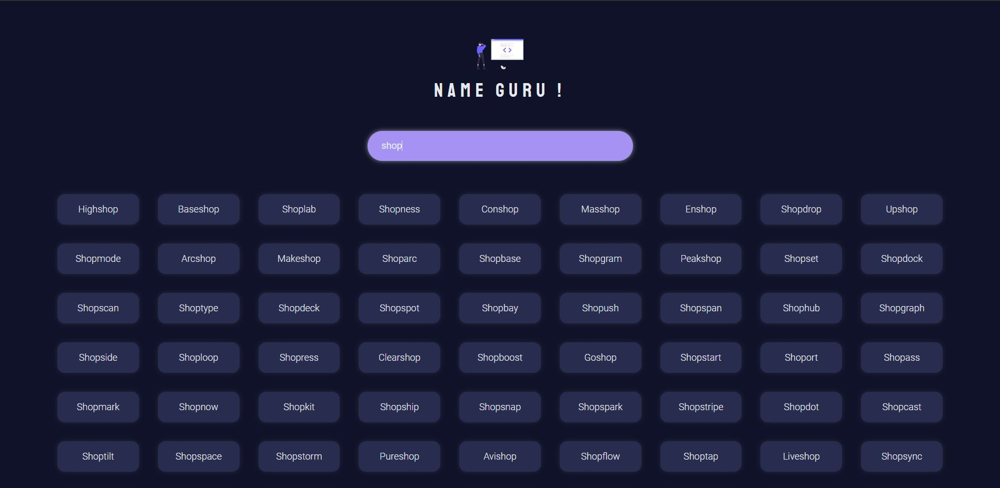

# NameGuru - A startup name generator

## About NameGuru App

- A React app that helps you with cool ideas of names for your new venture by searching the names with keywords.
- Gives **auto results** as you type with cool UI and animations.
- On click of the suggested name cards in the results will take you to the **namecheap** page to see the availability of domain names in case you are willing to purchase one.
- Uses **@rstacruz/startup-name-generator** - npm package for generating app names. You can find the usage instructions for the package in it's official docs.
- Built using react functional components and hooks. Also the app is completely responsive for better rendering and user experience accross all devices.
